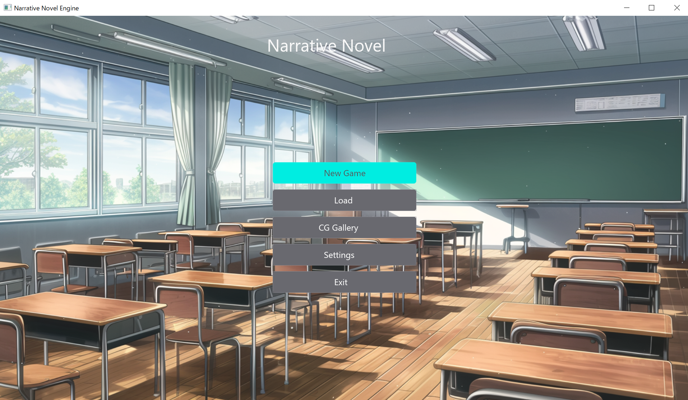
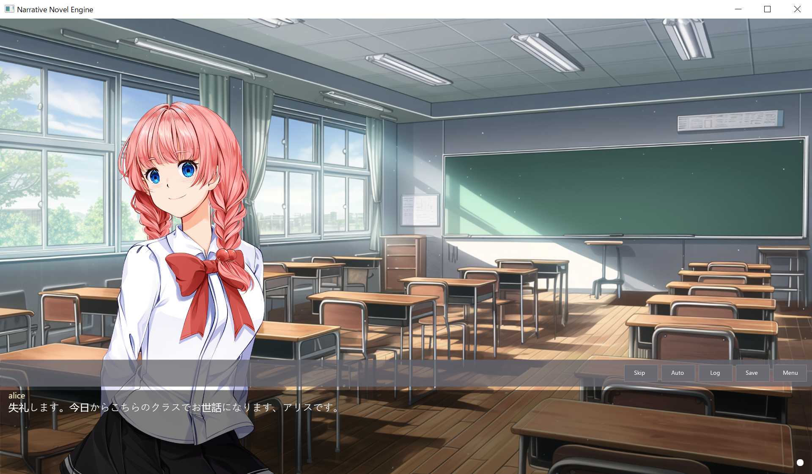

# Narrative Novel Engine

A wgpu-based visual novel engine





## Quick Start

```sh
# Run with default settings
cargo run

# Run with dev features (debug overlay, etc.)
cargo run --features dev
```

## Using Just (Recommended)

```sh
# Run in development mode
just dev

# Run with dev features
just dev-full

# Run in release mode
just release
```

## Development

### Default Resolution

Default development resolution: **1280x720 (720p)**

Available resolutions (can be changed in settings with immediate effect):
- 1280x720 (720p HD)
- 1920x1080 (1080p Full HD)
- 2560x1440 (1440p 2K)
- 3840x2160 (2160p 4K UHD)

### Commands

```sh
# Build
cargo build

# Test
cargo test

# Format
cargo fmt

# Clippy
cargo clippy -- -D warnings
```

## Project Structure

```
app/
├── core/     # Shared type definitions
├── engine/   # Game engine
├── gui/      # GUI framework
├── game/     # Game player
├── editor/   # Editor (placeholder)
└── tools/    # Development tools
```

## Documentation

- `CLAUDE.md` - Development guidelines
- `docs/testing-guidelines.md` - Test code organization rules
- `docs/scenario-format.md` - Scenario format specification
- `docs/design/` - Design documents

See each document for details.
